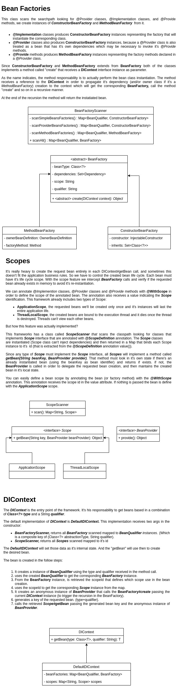

# simple-di-framework

This project is a (really) simplied version of the dependency injection
frameworks around. It was product from my "internal" studies of spring-context
module and I developed this with the purpose to "clarify" to other devs how
a dependency injection framework works under the hood.

It has the following features:

* providers of beans (similar to spring @Configuration) that supports injection
* constructor dependency injection
* on-demand bean creation (beans are only created when they're necessary)
* scopes that controls the bean life cycle
* scopes auto scan in order to ease the implementation of custom scopes
* cyclic dependency check (TO-DO)

I'd happy to respond all kind of issue from the community.

Hope this content helps anyone who wants to learn more 'bout reflection, annotation
processing and dependency injection in general.

This is how the *simple-di-framework* works:

